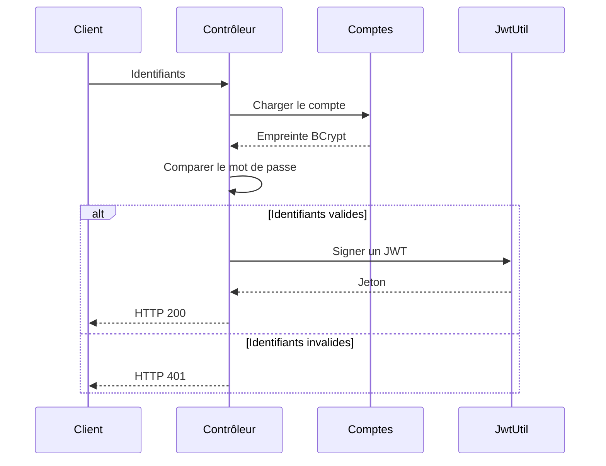
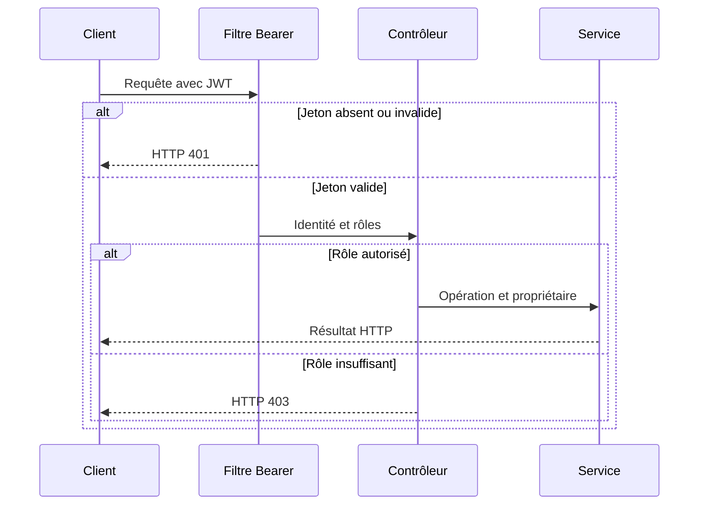

# Séquence de connexion

```mermaid
sequenceDiagram
    participant C as Client
    participant A as Contrôleur
    participant U as Comptes
    participant J as JwtUtil
    C->>A: Identifiants
    A->>U: Charger le compte
    U-->>A: Empreinte BCrypt
    A->>A: Comparer le mot de passe
    alt Identifiants valides
        A->>J: Signer un JWT
        J-->>A: Jeton
        A-->>C: HTTP 200
    else Identifiants invalides
        A-->>C: HTTP 401
    end
```

# Accès à une ressource

```mermaid
sequenceDiagram
    participant C as Client
    participant F as Filtre Bearer
    participant R as Contrôleur
    participant S as Service
    C->>F: Requête avec JWT
    alt Jeton absent ou invalide
        F-->>C: HTTP 401
    else Jeton valide
        F->>R: Identité et rôles
        alt Rôle autorisé
            R->>S: Opération et propriétaire
            S-->>C: Résultat HTTP
        else Rôle insuffisant
            R-->>C: HTTP 403
        end
    end
```
